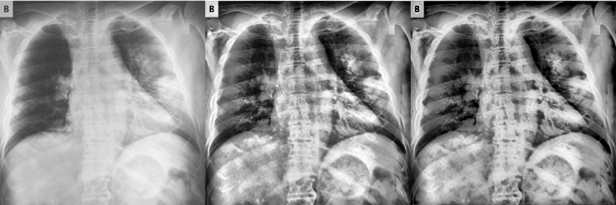
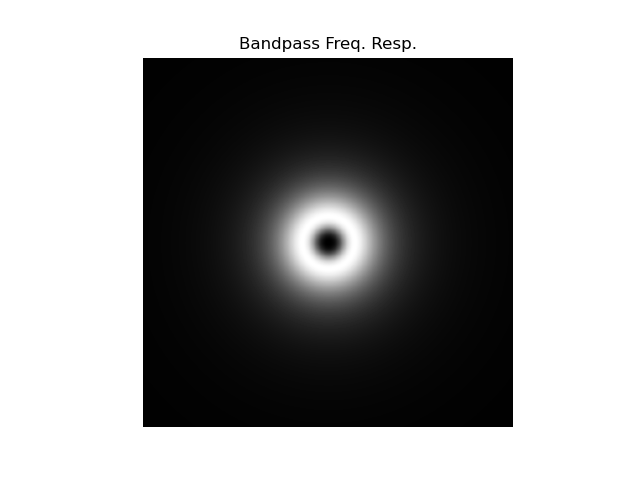

<h1>Hybrid Deep Learning Framework For COVID Detection</h1>

<h3>Preprocessing</h3>

    Contrast-limited adaptive histogram equalization (CLAHE) was applied to enhance fine-detail visibility in the low-contrast XRAY images. Subsequently, to mitigate the noise introduced by CLAHE, spectral subtraction was employed via a Butterworth bandpass filter within the frequency range of [30, 50] Hz.

 

    </img>
     
    Figure 1. (left) original covid chest xray, (center) chest xray after applying CLAHE, (right) chest xray after bandpass filtering.
      
    
     
    Figure 2. Frequency response of Butterworth bandpass filter used.

